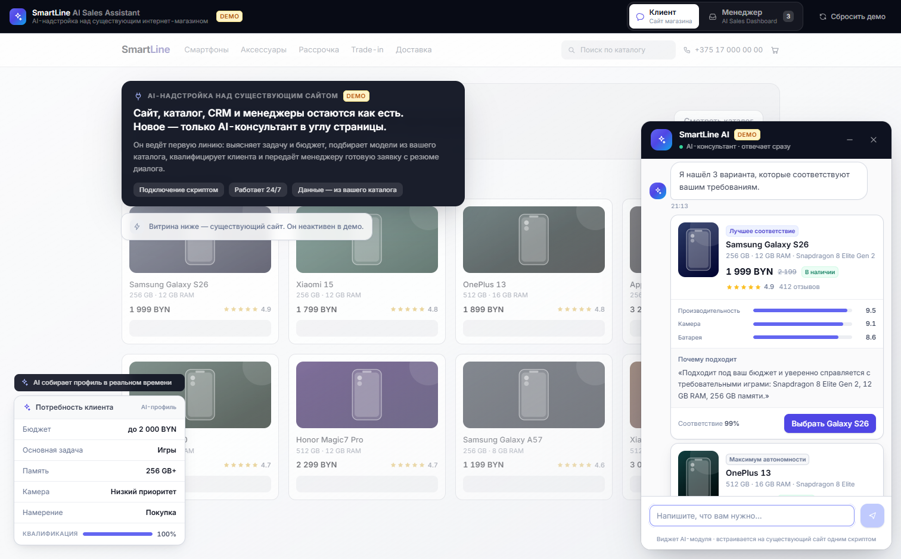
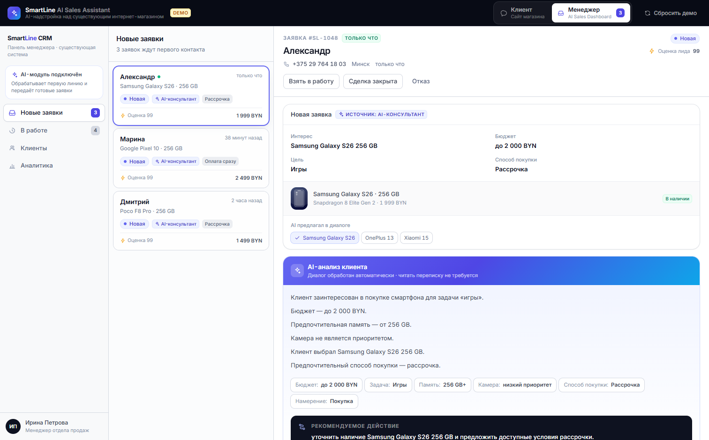
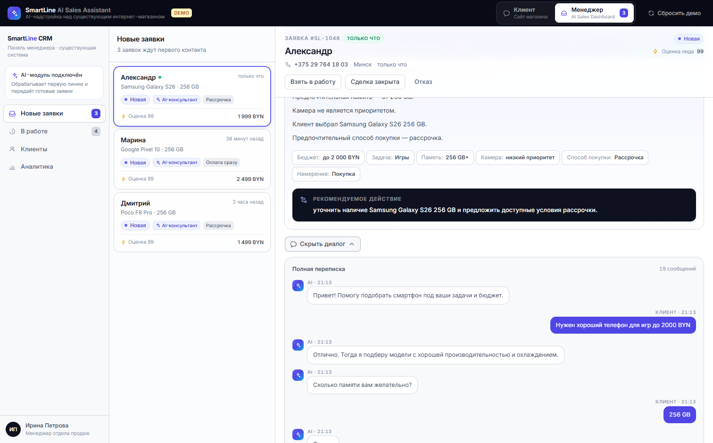
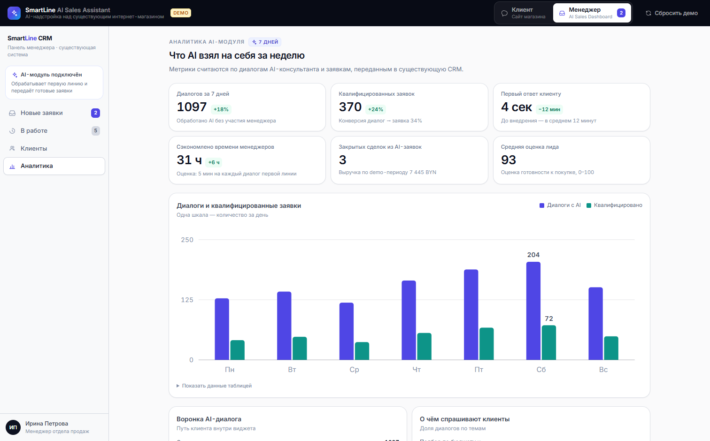

# SmartLine AI Sales Assistant — DEMO-прототип

Демонстрационный прототип **AI-надстройки над уже существующим интернет-магазином**
смартфонов SmartLine.

Это **не интернет-магазин**. Сайт, каталог, корзина, CRM и менеджеры считаются уже
работающими. Прототип показывает только новый модуль: AI-консультанта, который ведёт
первую линию общения с клиентом и передаёт менеджеру готовую заявку.



Витрина на фоне приглушена намеренно — это условный существующий сайт магазина.
Новое здесь только одно: виджет AI-консультанта справа и профиль потребности слева,
который собирается в реальном времени по ходу разговора.



Менеджеру не нужно читать переписку: AI уже выделил бюджет, задачу, выбранную модель
и способ покупки, а также предложил следующий шаг.

<details>
<summary>Ещё скриншоты: полный диалог и аналитика</summary>





</details>

---

## Запуск

```bash
npm install
npm run dev
```

Откроется `http://localhost:5173`. Нужен Node.js 18+.

Другие команды:

```bash
npm run build       # production-сборка
npm run typecheck   # проверка типов
npm run preview     # локальный просмотр собранной версии
```

<details>
<summary>Если <code>npm install</code> подвисает на минуты</summary>

На некоторых Windows-машинах npm сначала пытается подключиться к реестру по IPv6
и ждёт таймаут (~133 с на каждый запрос). Лечится принудительным IPv4:

```bash
# PowerShell
$env:NODE_OPTIONS="--dns-result-order=ipv4first"; npm install
```

```bash
# bash
NODE_OPTIONS=--dns-result-order=ipv4first npm install
```

Если сборка падает с `Cannot find module @rollup/rollup-win32-x64-msvc` — это
известный баг npm с опциональными зависимостями после прерванной установки:
удалите `node_modules` и `package-lock.json` и установите заново.

</details>

---

## Сценарий для записи видео (45–90 секунд)

Демо состоит из двух экранов, переключатель — в верхней панели.

**Экран 1 — «Клиент»**

1. На странице существующего сайта в правом нижнем углу появляется виджет **SmartLine AI**.
2. Написать или нажать быстрый ответ: **«Нужен хороший телефон для игр до 2000 BYN»**.
3. AI подтверждает задачу и спрашивает про память → нажать **256 GB**.
4. AI спрашивает про камеру → нажать **Не очень**.
5. AI показывает блок **«Потребность клиента»** и **3 карточки товаров** с объяснением,
   почему каждая подходит. Слева одновременно заполняется живой AI-профиль.
6. Нажать **«Выбрать Galaxy S26»** → AI называет цену и предлагает передать данные менеджеру.
7. Нажать **«Получить консультацию менеджера»** → выбрать **«Рассрочка»**.
8. Телефон и имя уже подставлены для скорости демо → нажать **«Передать менеджеру»**.
9. Появляется блок **«Заявка #SL-1048 передана менеджеру»** и кнопка перехода в панель.

**Экран 2 — «Менеджер» (AI Sales Dashboard)**

10. Заявка **#SL-1048** — первая в списке «Новые заявки», с пометкой «только что».
11. В карточке: структурированная заявка (интерес, бюджет, цель, способ покупки).
12. Ниже — главный блок **«AI-анализ клиента»** с резюме и рекомендуемым действием.
13. Кнопка **«Посмотреть диалог»** раскрывает всю переписку.
14. Блок **«AI подготовил ответ»** — готовый черновик; кнопки «Скопировать» / «Отправить».
15. Нажать **«Отправить»** → статус меняется на **«Ответ отправлен»**.
16. Дополнительно: **«AI рекомендует следующий шаг»** — подсказка менеджеру.

Кнопка **«Сбросить демо»** в верхней панели возвращает всё в исходное состояние —
можно записывать дубли.

> Заявка `#SL-1048` заранее подготовлена: она уже есть в панели менеджера, а при
> прохождении клиентского сценария перезаписывается живым диалогом. Поэтому демо
> работает и «с начала», и если сразу открыть панель менеджера.

---

## Где находится DEMO AI logic

| Что | Файл |
|---|---|
| **Весь «мозг» AI: NLU, диалоговая политика, резюме, черновик ответа, следующий шаг** | [src/services/aiService.ts](src/services/aiService.ts) |
| Извлечение слотов из текста клиента (бюджет, задача, память, камера) | `extractSlots()` в [aiService.ts](src/services/aiService.ts) |
| Ответы на типовые вопросы (доставка, гарантия, trade-in, рассрочка, наличие) | `FAQ_PATTERNS` в [aiService.ts](src/services/aiService.ts) |
| Что и в каком порядке спрашивать | `firstMissingSlot()` / `questionFor()` |
| Подбор товаров и объяснение «почему подходит» | [src/services/productService.ts](src/services/productService.ts) |
| Заявки: создание, статусы, отправка ответа | [src/services/leadService.ts](src/services/leadService.ts) |
| Метрики AI-модуля | [src/services/analyticsService.ts](src/services/analyticsService.ts) |
| Имитация «AI печатает…» (500–1200 мс) | `aiService.typingDelay()` + `playTurns()` в [ChatWidget.tsx](src/components/client/ChatWidget.tsx) |

Внешние AI-вызовы отсутствуют: демо детерминировано и работает офлайн.

### Важное архитектурное решение

Цены, наличие и характеристики **никогда не генерируются текстом** — они всегда берутся
из `productService`. LLM (когда её подключат) отвечает только за формулировки и понимание
свободного текста. Подбор остаётся детерминированным, поэтому его можно показывать
владельцу бизнеса без риска, что модель выдумает цену или скидку.

AI также намеренно **не имитирует одобрение рассрочки или кредита** — он только фиксирует
предпочтение клиента и передаёт его менеджеру.

---

## Где подключить реальный AI API

Точка расширения — интерфейс `AiProvider` в [src/services/aiService.ts](src/services/aiService.ts).

```ts
export interface AiProvider {
  reply(state: ConversationState, userText: string): AiResult
  act(state: ConversationState, action: AiAction): AiResult
  greeting(): AiTurn
}
```

Сейчас активен `demoProvider` (движок на правилах). Чтобы перейти на реальную модель:

1. Реализовать `AiProvider` — готовый шаблон `createAnthropicProvider()` лежит
   в комментарии **в конце** `aiService.ts` (Anthropic Messages API + tool use,
   а также вариант для OpenAI).
2. Заменить одну строку:

```ts
// было
const provider: AiProvider = demoProvider
// станет
const provider: AiProvider = createAnthropicProvider({ endpoint: '/api/ai/chat' })
```

Компоненты интерфейса при этом не меняются.

Рекомендация: вызывать модель через собственный backend-прокси (`POST /api/ai/chat`),
чтобы API-ключ не попадал в браузер.

Аналогично сделаны точки подключения к существующей инфраструктуре:

- **каталог магазина** — `PRODUCT_SOURCE` в `productService.ts`
  (заменяется на `fetch('/api/catalog')`);
- **CRM** — `leadService.create()` (заменяется на `POST /api/crm/leads`).

---

## Структура

```
src/
├── types/index.ts               доменные типы AI-модуля
├── data/
│   ├── products.ts              mock-каталог: 20 смартфонов
│   ├── leads.ts                 10 demo-заявок + эталонный сценарий #SL-1048
│   └── crm.ts                   клиенты и закрытые сделки (условно из CRM)
├── services/
│   ├── aiService.ts             DEMO AI logic + точка подключения реального API
│   ├── productService.ts        подбор товаров и объяснения
│   ├── leadService.ts           заявки (observable store)
│   └── analyticsService.ts      метрики AI-модуля
├── components/
│   ├── client/                  ЭКРАН 1: виджет AI на существующем сайте
│   │   ├── ClientDemoScreen.tsx
│   │   ├── StoreBackdrop.tsx    макет существующего сайта (неактивный фон)
│   │   ├── ChatWidget.tsx       диалог, очередь реплик, typing indicator
│   │   ├── ChatWidgets.tsx      блоки внутри диалога (выбор, контакты, заявка)
│   │   ├── ProductChatCard.tsx  карточка товара внутри диалога
│   │   └── NeedProfileCard.tsx  «Потребность клиента»
│   ├── manager/                 ЭКРАН 2: AI Sales Dashboard
│   │   ├── ManagerDashboard.tsx сайдбар + очередь + карточка
│   │   ├── LeadList.tsx
│   │   ├── LeadDetail.tsx
│   │   ├── AiSummaryCard.tsx    «AI-анализ клиента»
│   │   ├── ConversationLog.tsx  полный диалог
│   │   ├── AnalyticsView.tsx    KPI и графики
│   │   └── ClientsView.tsx
│   └── ui/                      примитивы и иконки
└── App.tsx                      оболочка демо: переключение экранов, сброс
```

Стек: React 18 · TypeScript · Vite 5 · Tailwind CSS 3. Внешних UI-библиотек нет —
иконки и графики нарисованы инлайновым SVG.

---

## Что намеренно НЕ реализовано

Всё это считается уже существующим у бизнеса либо не нужно для демонстрации:

главная страница магазина, полный каталог, корзина, оплата, регистрация и личный
кабинет, реальная CRM, реальные интеграции с Telegram / WhatsApp, банковские
интеграции и авторизация.

Кнопка «Отправить» в панели менеджера меняет только статус — реальная отправка
сообщений не подключена.
